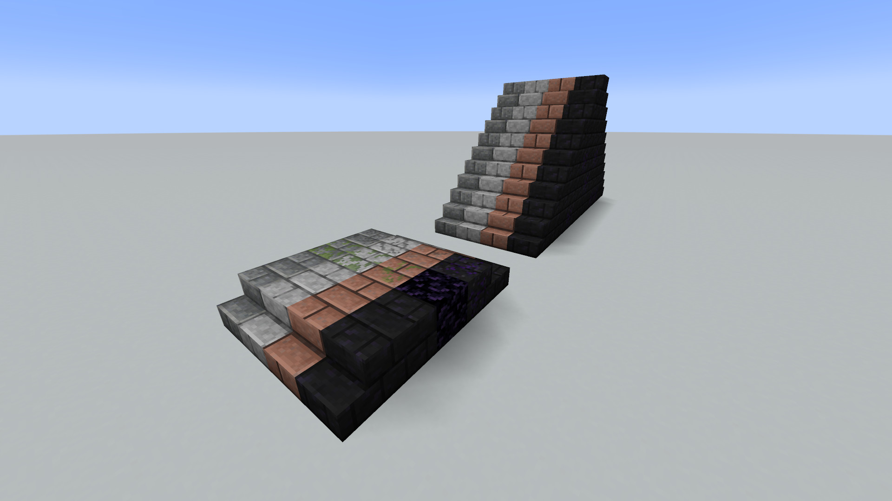
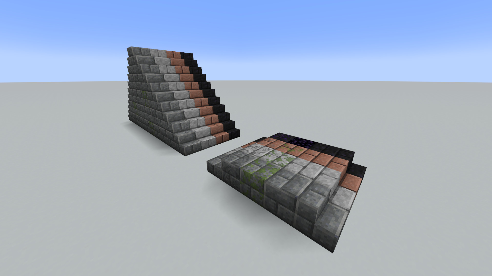
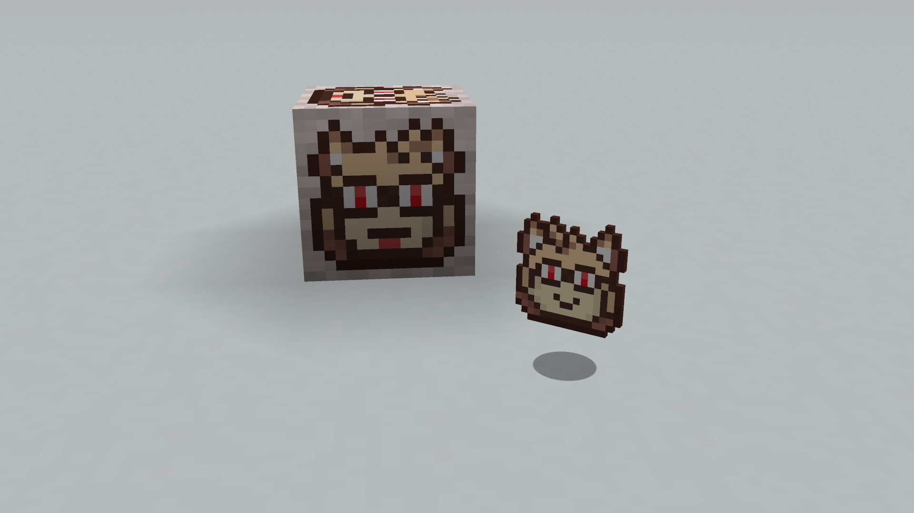

# Molasses' Enhancements

A Minecraft mod for [Fabric](https://github.com/FabricMC), adding various new building blocks!

## License
Molasses' Enhancements is available under the terms
of the [Apache v2.0 license](LICENSE-APACHE.md) or 
[MIT license](LICENSE-MIT.md), at your choice.

## Preview

