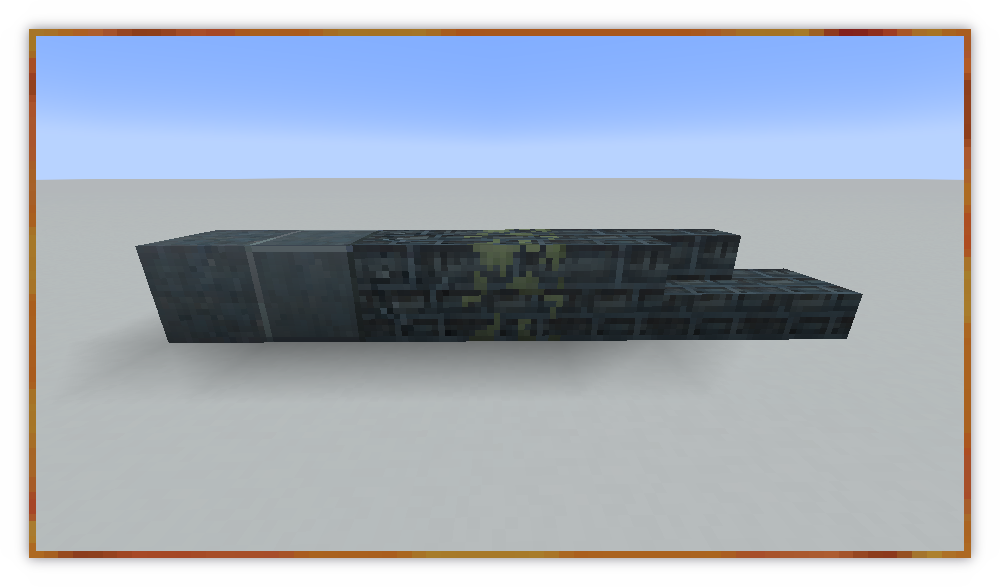
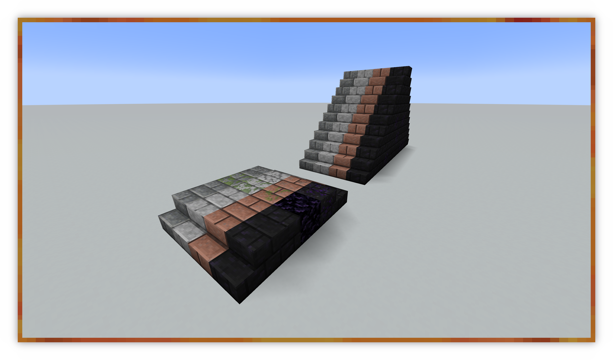
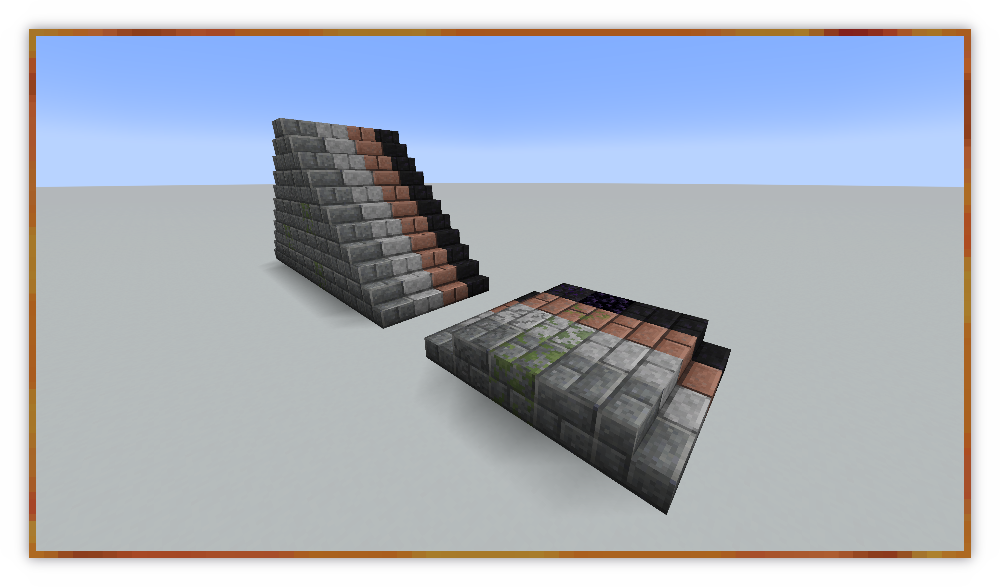
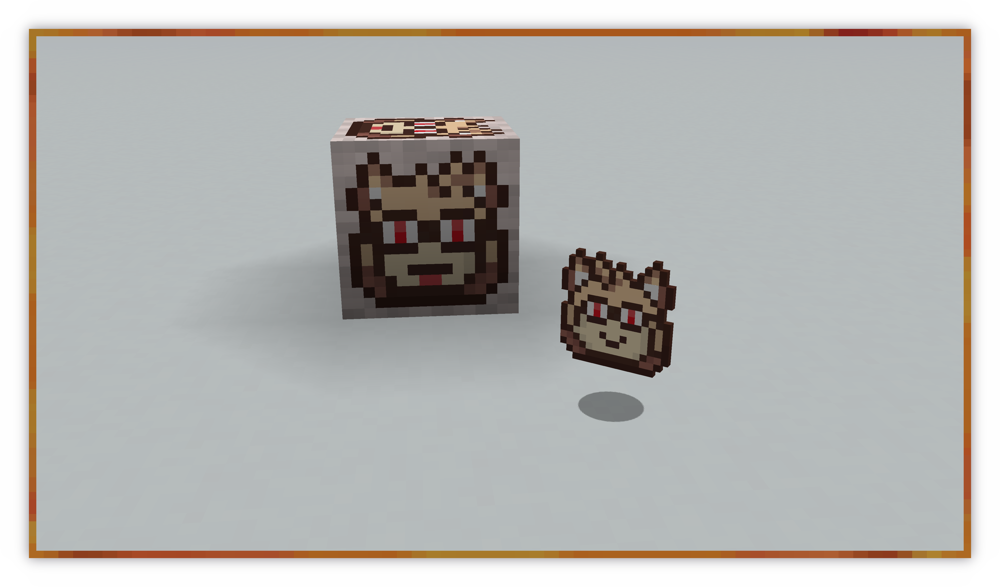

# Molasses' Enhancements
[](https://ko-fi.com/molasses)
[](https://www.patreon.com/molasseslover)
[](https://www.curseforge.com/minecraft/mc-mods/molasses-enhancements)

> **Note**: This project is no longer active.

A Minecraft mod for [Fabric](https://github.com/FabricMC), 
adding various new building blocks!

# Cloning
This repository uses Git submodules in the [`dev/`](dev/),
directory. Make sure to clone those in order to use 
development scripts. 

```sh
➜ git clone --recursive https://github.com/MolassesLover/MolassesEnhancements
```

If you already cloned the repository without submodules;
make sure to run these commands:
```sh
➜ git submodule init
➜ git submodule update
```

## License
### Code
The source code (kept in the [`src/main/java/`](src/main/java) directory) 
is licensed under the [Apache v2.0 license](LICENSE-APACHE.md) or 
[MIT license](LICENSE-MIT.md) at your choice. 

### Art
Art assets (kept in the
[`src/main/resources/`](src/main/resources) directory) are licensed 
under [Creative Commons Attribution-ShareAlike v4.0](LICENSE-CC-BY-SA.md).

### Translations
The contents of the [`lang/`](src/main/resources/assets/molassesenhancements/lang) 
directory (despite being in the [`src/main/resources/`](src/main/resources) directory) 
are licensed under [Creative Commons Zero](LICENSE-CC0.md).

## Preview




